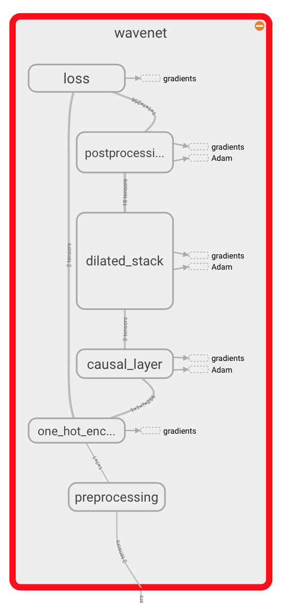

# A TensorFlow implementation of DeepMind's WaveNet paper

This is a TensorFlow implementation of the [WaveNet generative neural
network architecture](https://deepmind.com/blog/wavenet-generative-model-raw-audio/) for audio generation.

The WaveNet architecture directly generates a raw audio waveform,
and shows excellent results in TTS and general audio generation (see the
DeepMind blog post and paper for examples).

The network is a model of the conditional probability to generate the next
sample in the audio waveform, given all previous samples and possibly
additional parameters.
It is constructed from a stack of *causal dilated layers*, each of which is a
dilated convolution (convolution with holes), which only accesses the current and past audio samples.

The network itself is implemented in the file [`wavenet.py`](./wavenet.py).

<p align="center">
</img>
</p>

## Requirements

TensorFlow needs to be installed before running the training script.
TensorFlow 0.10 and the current `master` version are supported.

In addition, the `ffmpeg` binary needs to be available on the command line.
It is needed by the TensorFlow ffmpeg contrib package that is used to decode the audio files.

## Training the network

The [VCTK corpus](http://homepages.inf.ed.ac.uk/jyamagis/page3/page58/page58.html) is currently used.
In order to train the network, you need to download the corpus and unpack it in the same directory as the `train.py` script.

Then, execute
```bash
python train.py
```
to train the network.

You can see documentation on the settings by by running
```bash
python train.py --help
```

## Generating audio

You can use the `generate.py` script to generate audio using a previously trained model.

Run
```
python generate.py --samples 16000 model.ckpt-1000
```
where `model.ckpt-1000` needs to be a previously saved model.
You can find these in the `logdir`.

The generated waveform can be played back using TensorBoard.

## Missing features

Currently, there is no conditioning on extra information like the speaker ID.

**Disclaimer:** This repository is not affiliated with DeepMind or Google in any way.
